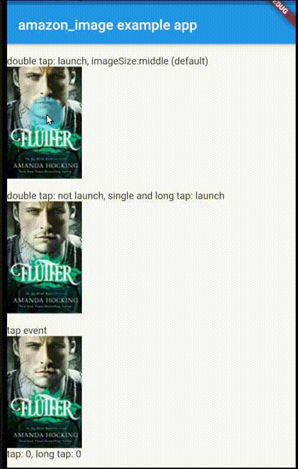

# amazon_image

Widget to display image from amazon

## Getting Started

When we create an app, we want to use images. Where do we get the images from?
There are many great sites that allow ue to use photos and images for free.
But what about copyrighted material? There is a good site that handles those images. It's Amazon, as you all know.

This package make us to use images easily from Amazon's site. Are they okay?
It must be okay because this is an image of an advertisement with an affiliate on it. See, if we double click on it, it will open the Amazon site.
If our users buy the product outright, it will pay for the development of this package. Or, if you have your own affiliate ID, you can set that up as well.



## Note
Unfortunately, not all images can be used. I was able to use images of books and major toys, but not images of minor toys or DVDs.
Please make sure that the images you want to use will be displayed.

## Usage
First, let's check the asin.


If you set it in pubspec.yaml and do the following, it will be displayed.

```
Widget build(BuildContext context) {
	return AmazonImage('B003O2SHKG');
}
```

We can choose from three different image sizes. It is middle in default.
```
AmazonImage(
  asin,
  imageSize: ImageSize.Large,
),
```


The behavior to jump to the Amazon site can be enabled from Tap, DoubleTap, or LongPress.
If we don't want to set that behavior, we can do something else.
```
AmazonImage(
  asin,
  isLaunchAfterTap: true,
  isLaunchAfterDoubleTap: false,
  isLaunchAfterLongTap: true,
),
```

We can perform a specific process before or after jumping to the Amazon site.
```
AmazonImage(
  asin,
  context: context,
  functionBeforeLaunch: (BuildContext context) async {
    var result = await askUser();
    return Future.value(result);
  },
),
```
We can get the country from the environment variable. If it is one of the following countries, we will get the image and link for that country. If not, the image and link for USA will be retrieved.
```
AmazonImageSetting().setTrackingId(trackingId);
```

##  Contact
If you have anything you want to inform me (@SakushinFlutter), such as suggestions to enhance this package or functionalities you want etc, feel free to make issues on [GitHub](https://github.com/sakushin-udemy/amazon_image) or send messages on Twitter @SakushinFlutter.